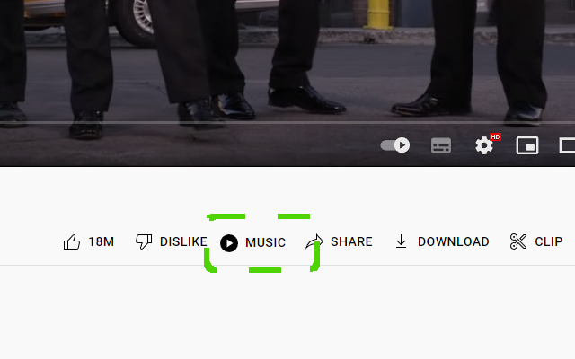
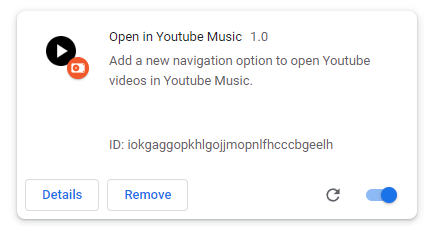

 Adds GUI functionality to open the current youtube video in YouTube Music.

| |
|:---:|
|  |
| Install the GitHub1s extension in the [Chrome web store](). |

## About
| |
|:---:|
|  |
| This extension creates additional UI below Youtube videos, making it easy to open them inside Youtube Music. |

## Manual installation
| |
|:---:|
|  |
| Navigate to `chrome://extensions` and `load unpacked`. |

1. Clone this repository onto your device.
2. Navigate to `chrome://extensions/`.
3. Open the file explorer using `Load unpacked` and navigate to the root folder of this repository. 
4. Select this folder, and the extension should load into your list of browser extensions.

## User options
| Extension card | Options page |
|:---:|:---:|
|  |  |

The extension can be configured from `chrome://extensions` using the `options` button on the extension card. Users can select between opening Youtube Music in the current tab (redirect) or opening the website in a new tab. The extension defaults to redirecting in the current tab.

## License
MIT